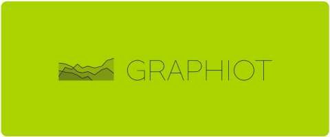

# GraphIoT

GraphIoT is a .NET Core project for polling and storing historical IoT and smart home sensor data and providing it for visualization as time series graphs.

The main server application consists of these two major parts for this purpose:

1. **Data Gathering**
    * A set of timed hosted services that regularly poll data from other servers, e.g. home servers of smart home systems or cloud apis of smart home device manufacturers. These values are stored in a configurable database. Currently it supports polling from:
        * Digitalstrom DSS (home server)
        * Netatmo (Cloud API)
        * Sonnen (Cloud API)
        * Viessmann (Cloud API)
2. **Data Visualization**
    * A set of RESTful APIs to retrieve the time series data
    * Grafana visualization via:
        * a grafana hosted service that starts and monitors the grafana server process
        * a reverse proxy middleware that redirects to the grafana server
        * a REST+json api that loads, aggregates and preprocesses the stored data and outputs it in a grafana JSON datasource compatible format

## Code Structure

GraphIoT consists of several subprojects, some of which are independent of GraphIoT dependencies and can be used within other applications as nuget packages.

It is structured as follows:

* Client libaries for communicating with a specific IoT device type:
  * DigitalstromClient
  * DigitalstromTwin
  * NetatmoClient
  * SonnenClient
  * ViessmannClient
* Shared libraries for common functionality in GraphIoT Host libraries:
  * GraphIoT.Core
  * TokenStore
  * [CompactTimeSeries](src/CompactTimeSeries/README.md)
* Host Libraries that derive from GraphIoT.Core for a specific IoT device type:
  * GraphIoT.Digitalstrom
  * GraphIoT.Netatmo
  * GraphIoT.Sonnen
  * GraphIoT.Viessmann
* Visualization middleware and APIs:
  * GraphIoT.Grafana
* Main server application:
  * GraphIoT.App

## Platform Support

GraphIoT is compiled for .NET Core 2.2.

## License

The MIT License (MIT)

Copyright (c) 2019 Philip Daubmeier

Permission is hereby granted, free of charge, to any person obtaining a copy
of this software and associated documentation files (the "Software"), to deal
in the Software without restriction, including without limitation the rights
to use, copy, modify, merge, publish, distribute, sublicense, and/or sell
copies of the Software, and to permit persons to whom the Software is
furnished to do so, subject to the following conditions:

The above copyright notice and this permission notice shall be included in all
copies or substantial portions of the Software.

THE SOFTWARE IS PROVIDED "AS IS", WITHOUT WARRANTY OF ANY KIND, EXPRESS OR
IMPLIED, INCLUDING BUT NOT LIMITED TO THE WARRANTIES OF MERCHANTABILITY,
FITNESS FOR A PARTICULAR PURPOSE AND NONINFRINGEMENT. IN NO EVENT SHALL THE
AUTHORS OR COPYRIGHT HOLDERS BE LIABLE FOR ANY CLAIM, DAMAGES OR OTHER
LIABILITY, WHETHER IN AN ACTION OF CONTRACT, TORT OR OTHERWISE, ARISING FROM,
OUT OF OR IN CONNECTION WITH THE SOFTWARE OR THE USE OR OTHER DEALINGS IN THE
SOFTWARE.
